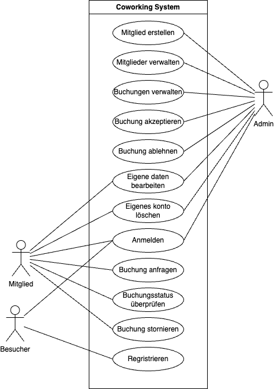
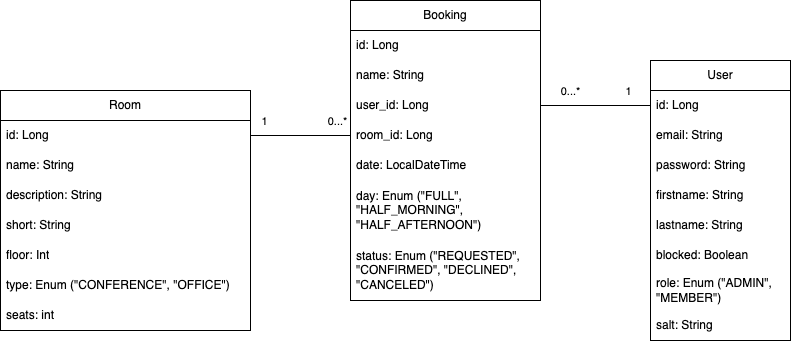
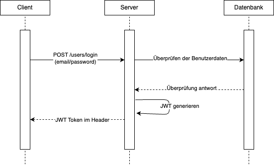

# Dokumentation für die LB B - Modul 223

## Beschreibung

Eine Webapplikation für die Verwaltung eines Coworking Spaces. Die Plattform ermöglicht es Mitgliedern und Administratoren, sich anzumelden, ihre persönlichen Daten zu verwalten, Reservierungen zu erstellen und zu bearbeiten, sowie Informationen über den Coworking Space zu erhalten.

## Aufsetzung des Projekts

### Voraussetzungen

- Docker
- Docker Compose
- Java 22

TODO

## Starten des Projekts

TODO

## Inhaltsverzeichnis

1. [Erweiterte Anforderungen](#Erweiterte-Anforderungen)
2. [Persona](#Persona)
3. [Anwendungsfalldiagramm](#Anwendungsfalldiagramm)
4. [Fachklassendiagramm](#Fachklassendiagramm)
5. [Schnittstellenplanung](#Schnittstellenplanung)
6. [Sequenzdiagramm](#Sequenzdiagramm)
7. [Testdaten](#Testdaten)

## Erweiterte Anforderungen

### A. Drei zusätzliche, einzigartige, funktionale Anforderungen sind als User Stories beschrieben

1. Als Mitglied oder Administrator, kann ich meine persönlichen Daten bearbeiten, um sie aktuell zu halten.
2. Als Mitglied oder Administrator, kann ich mein Konto löschen, um den Zugriff auf die Plattform zu beenden.
3. Als Administrator, kann ich Mitglieder sperren, um den Zugriff auf die Plattform zu verhindern.

### B. Drei zusätzliche, einzigartige, nicht-funktionale Anforderungen sind messbar beschrieben

1. Die Antwortzeit der Plattform soll unter 5 Sekunden liegen.
2. Die Plattform soll mindestens 99% der Zeit verfügbar sein.
3. Die Plattform soll dem Benutzer eine intuitive Benutzeroberfläche bieten.

## Persona

### Persona 1: Administrator

**Name:** Michael Baumann  
**Alter:** 45 Jahre  
**Geschlecht:** Männlich  
**Berufliche Tätigkeit:** Betriebsleiter eines Coworking Spaces  
**Grund für die Nutzung des Coworking Spaces:** Michael nutzt das Coworking Space, um eine moderne Arbeitsumgebung zu schaffen, die flexibel auf die Bedürfnisse seiner Kunden eingeht. Er möchte eine produktive und inspirierende Atmosphäre bieten und gleichzeitig die Effizienz und Organisation des Raums verbessern.

### Persona 2: Mitglied

**Name:** Friedrich Meier  
**Alter:** 43 Jahre  
**Geschlecht:** Mänlich  
**Berufliche Tätigkeit:** Freiberuflicher Grafikdesigner  
**Grund für die Nutzung des Coworking Spaces:** Friedrich nutzt den Coworking Space, um einen professionellen Arbeitsplatz zu haben, der er von den Ablenkungen zu Hause fernhält. Er schätzt die Möglichkeit des Networking und die inspirierende Umgebung, die ihre Kreativität fördert.

### Persona 3: Besucher

**Name:** Tom Weber  
**Alter:** 28 Jahre  
**Geschlecht:** Männlich  
**Berufliche Tätigkeit:** Start-up-Gründer im Tech-Bereich  
**Grund für die Nutzung des Coworking Spaces:** Tom ist auf der Suche nach einem geeigneten Arbeitsplatz für sein Start-up-Team. Er möchte eine Umgebung schaffen, die die Zusammenarbeit und den Austausch von Ideen fördert und gleichzeitig flexibel und kosteneffizient ist.

## Anwendungsfalldiagramm

## Fachklassendiagramm

## Schnittstellenplanung

Schnittstellenplanung von Coworking System API

<table>
  <thead>
    <tr>
      <th>Methode</th>
      <th>Endpunkt</th>
      <th>Erfolgs- und Fehlerfälle</th>
    </tr>
  </thead>
  <tbody>
    <tr>
      <td>GET</td>
      <td>/rooms</td>
      <td>
        
Erfolge:

        <ul>
          <li>200 Alle Räume</li>
        </ul>
        
Fehlerfall:

        <ul>
          <li>400 Bad Request</li>
          <li>401 Unauthorized</li>
          <li>403 Forbidden</li>
          <li>500 Internal Server Error</li>
        </ul>
      </td>
    </tr>
    <tr>
      <td>GET</td>
      <td>/rooms/{id}</td>
      <td>
        
Erfolge:

        <ul>
          <li>200 Raum mit ID</li>
        </ul>
        
Fehlerfall:

        <ul>
          <li>400 Bad Request</li>
          <li>401 Unauthorized</li>
          <li>403 Forbidden</li>
          <li>404 Not Found</li>
          <li>500 Internal Server Error</li>
        </ul>
      </td>
    </tr>
    <tr>
      <td>POST</td>
      <td>/rooms</td>
      <td>
        
Erfolge:

        <ul>
          <li>201 Raum erstellt</li>
        </ul>
        
Fehlerfall:

        <ul>
          <li>400 Bad Request</li>
          <li>401 Unauthorized</li>
          <li>403 Forbidden</li>
          <li>409 Conflict</li>
          <li>500 Internal Server Error</li>
        </ul>
      </td>
    </tr>
    <tr>
      <td>PUT</td>
      <td>/rooms/{id}</td>
      <td>
        
Erfolge:

        <ul>
          <li>200 Raum aktualisiert</li>
        </ul>
        
Fehlerfall:

        <ul>
          <li>400 Bad Request</li>
          <li>401 Unauthorized</li>
          <li>403 Forbidden</li>
          <li>404 Not Found</li>
          <li>500 Internal Server Error</li>
        </ul>
      </td>
    </tr>
    <tr>
      <td>PATCH</td>
      <td>/rooms/{id}</td>
      <td>
        
Erfolge:

        <ul>
          <li>200 Raum aktualisiert</li>
        </ul>
        
Fehlerfall:

        <ul>
          <li>400 Bad Request</li>
          <li>401 Unauthorized</li>
          <li>403 Forbidden</li>
          <li>404 Not Found</li>
          <li>500 Internal Server Error</li>
        </ul>
      </td>
    </tr>
    <tr>
      <td>DELETE</td>
      <td>/rooms/{id}</td>
      <td>
        
Erfolge:

        <ul>
          <li>204 Raum gelöscht</li>
        </ul>
        
Fehlerfall:

        <ul>
          <li>400 Bad Request</li>
          <li>401 Unauthorized</li>
          <li>403 Forbidden</li>
          <li>404 Not Found</li>
          <li>500 Internal Server Error</li>
        </ul>
      </td>
    </tr>
    <tr>
      <td>GET</td>
      <td>/bookings</td>
      <td>
        
Erfolge:

        <ul>
          <li>200 Alle Buchungen</li>
        </ul>
        
Fehlerfall:

        <ul>
          <li>400 Bad Request</li>
          <li>401 Unauthorized</li>
          <li>403 Forbidden</li>
          <li>500 Internal Server Error</li>
        </ul>
      </td>
    </tr>
    <tr>
      <td>GET</td>
      <td>/bookings/{id}</td>
      <td>
        
Erfolge:

        <ul>
          <li>200 Buchung mit ID</li>
        </ul>
        
Fehlerfall:

        <ul>
          <li>400 Bad Request</li>
          <li>401 Unauthorized</li>
          <li>403 Forbidden</li>
          <li>404 Not Found</li>
          <li>500 Internal Server Error</li>
        </ul>
      </td>
    </tr>
    <tr>
      <td>POST</td>
      <td>/bookings</td>
      <td>
        
Erfolge:

        <ul>
          <li>201 Buchung erstellt</li>
        </ul>
        
Fehlerfall:

        <ul>
          <li>400 Bad Request</li>
          <li>401 Unauthorized</li>
          <li>403 Forbidden</li>
          <li>409 Conflict</li>
          <li>500 Internal Server Error</li>
        </ul>
      </td>
    </tr>
    <tr>
      <td>PUT</td>
      <td>/bookings/{id}</td>
      <td>
        
Erfolge:

        <ul>
          <li>200 Buchung aktualisiert</li>
        </ul>
        
Fehlerfall:

        <ul>
          <li>400 Bad Request</li>
          <li>401 Unauthorized</li>
          <li>403 Forbidden</li>
          <li>404 Not Found</li>
          <li>500 Internal Server Error</li>
        </ul>
      </td>
    </tr>
    <tr>
      <td>PATCH</td>
      <td>/bookings/{id}</td>
      <td>
        
Erfolge:

        <ul>
          <li>200 Buchung aktualisiert</li>
        </ul>
        
Fehlerfall:

        <ul>
          <li>400 Bad Request</li>
          <li>401 Unauthorized</li>
          <li>403 Forbidden</li>
          <li>404 Not Found</li>
          <li>500 Internal Server Error</li>
        </ul>
      </td>
    </tr>
    <tr>
      <td>DELETE</td>
      <td>/bookings/{id}</td>
      <td>
        
Erfolge:

        <ul>
          <li>204 Buchung gelöscht</li>
        </ul>
        
Fehlerfall:

        <ul>
          <li>400 Bad Request</li>
          <li>401 Unauthorized</li>
          <li>403 Forbidden</li>
          <li>404 Not Found</li>
          <li>500 Internal Server Error</li>
        </ul>
      </td>
    </tr>
    <tr>
      <td>POST</td>
      <td>/users/login</td>
      <td>
        
Erfolge:

        <ul>
          <li>200 Login erfolgreich</li>
        </ul>
        
Fehlerfall:

        <ul>
          <li>400 Bad Request</li>
          <li>500 Internal Server Error</li>
        </ul>
      </td>
    </tr>
    <tr>
      <td>POST</td>
      <td>/users/register</td>
      <td>
        
Erfolge:

        <ul>
          <li>201 Registrierung erfolgreich</li>
        </ul>
        
Fehlerfall:

        <ul>
          <li>400 Bad Request</li>
          <li>409 Conflict</li>
          <li>500 Internal Server Error</li>
        </ul>
      </td>
    </tr>
    <tr>
      <td>GET</td>
      <td>/users/verified</td>
      <td>
        
Erfolge:

        <ul>
          <li>200 Verifizierung erfolgreich</li>
        </ul>
        
Fehlerfall:

        <ul>
          <li>400 Bad Request</li>
          <li>500 Internal Server Error</li>
        </ul>
      </td>
    </tr>
    <tr>
      <td>GET</td>
      <td>/users</td>
      <td>
        
Erfolge:

        <ul>
          <li>200 Alle Benutzer</li>
        </ul>
        
Fehlerfall:

        <ul>
          <li>400 Bad Request</li>
          <li>401 Unauthorized</li>
          <li>403 Forbidden</li>
          <li>500 Internal Server Error</li>
        </ul>
      </td>
    </tr>
    <tr>
      <td>GET</td>
      <td>/users/{id}</td>
      <td>
        
Erfolge:

        <ul>
          <li>200 Benutzer mit ID</li>
        </ul>
        
Fehlerfall:

        <ul>
          <li>400 Bad Request</li>
          <li>401 Unauthorized</li>
          <li>403 Forbidden</li>
          <li>404 Not Found</li>
          <li>500 Internal Server Error</li>
        </ul>
      </td>
    </tr>
    <tr>
      <td>PUT</td>
      <td>/users/{id}</td>
      <td>
        
Erfolge:

        <ul>
          <li>200 Benutzer aktualisiert</li>
        </ul>
        
Fehlerfall:

        <ul>
          <li>400 Bad Request</li>
          <li>401 Unauthorized</li>
          <li>403 Forbidden</li>
          <li>404 Not Found</li>
          <li>500 Internal Server Error</li>
        </ul>
      </td>
    </tr>
    <tr>
      <td>PATCH</td>
      <td>/users/{id}</td>
      <td>
        
Erfolge:

        <ul>
          <li>200 Benutzer aktualisiert</li>
        </ul>
        
Fehlerfall:

        <ul>
          <li>400 Bad Request</li>
          <li>401 Unauthorized</li>
          <li>403 Forbidden</li>
          <li>404 Not Found</li>
          <li>500 Internal Server Error</li>
        </ul>
      </td>
    </tr>
    <tr>
      <td>DELETE</td>
      <td>/users/{id}</td>
      <td>
        
Erfolge:

        <ul>
          <li>204 Benutzer gelöscht</li>
        </ul>
        
Fehlerfall:

        <ul>
          <li>400 Bad Request</li>
          <li>401 Unauthorized</li>
          <li>403 Forbidden</li>
          <li>404 Not Found</li>
          <li>500 Internal Server Error</li>
        </ul>
      </td>
    </tr>
  </tbody>
</table>

## Sequenzdiagramm

## Testdaten

TODO
